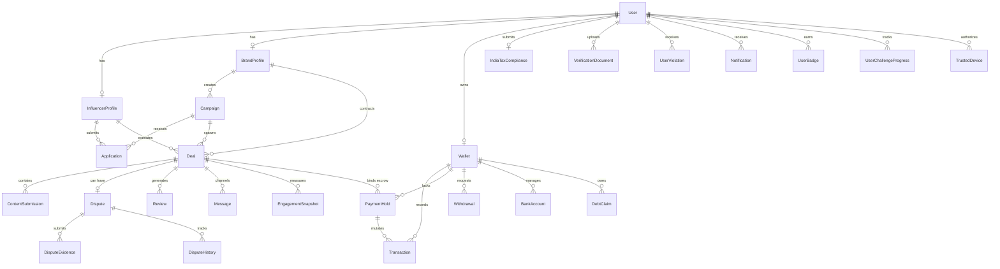
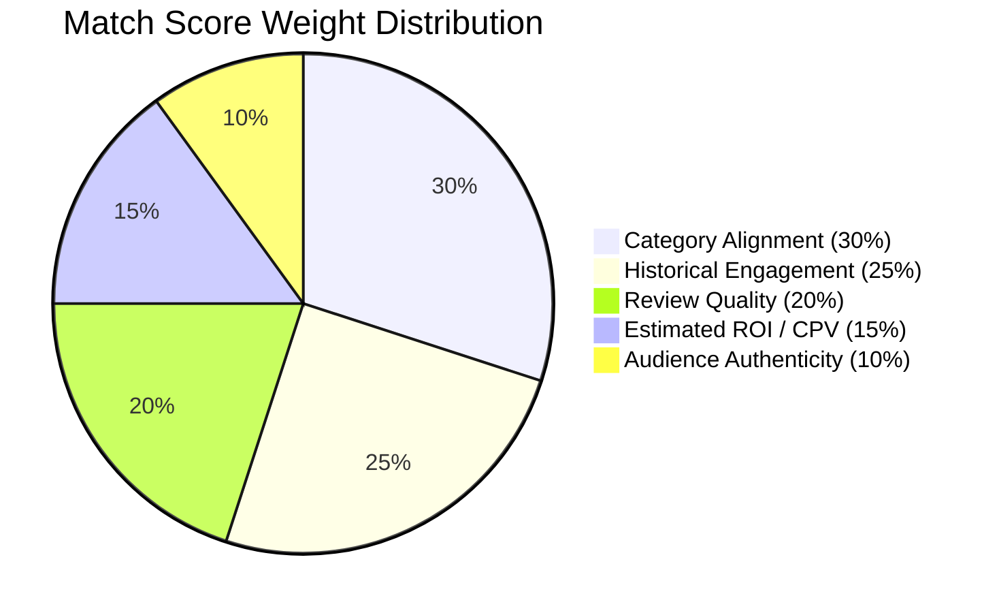
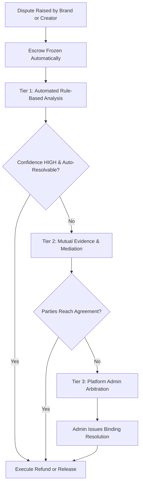
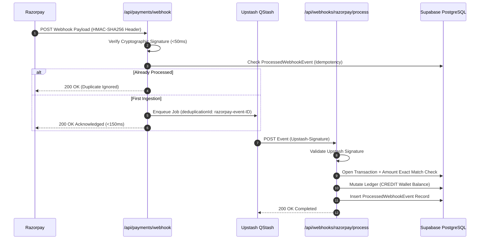
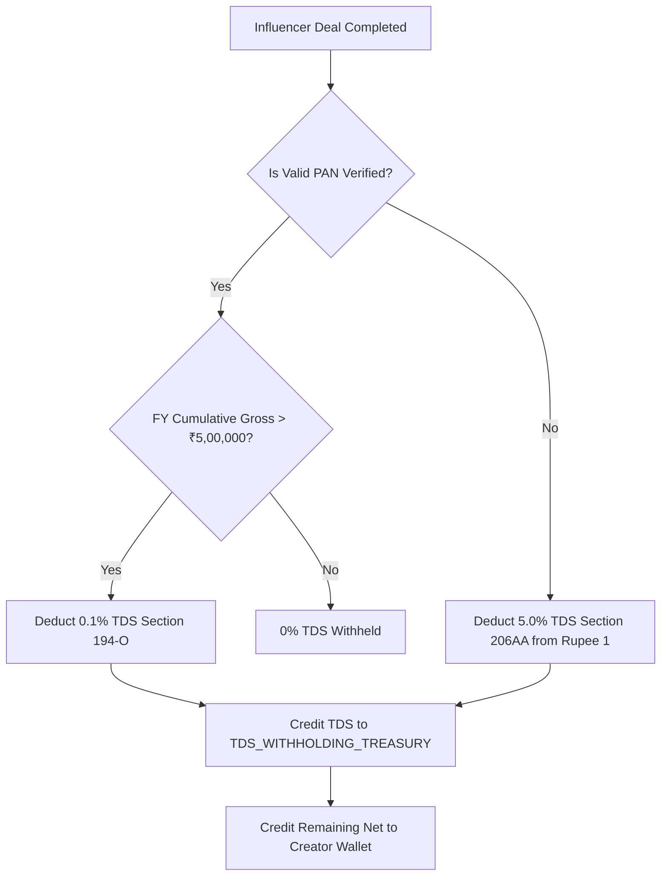

# VyaparMedia - Comprehensive Product Requirements Document (PRD)

**Version**: 3.0 (Master Technical Specification & Enterprise Production Baseline)  
**Last Updated**: September 2026  
**Document Status**: Production-Ready, Error-Sanitized & Enterprise-Hardened  
**Target Scale**: 10,0,000+ (10 Lakh) Concurrent Active Users  
**Primary Region**: India (IN) — Multi-lingual & Tier 1/2/3 Regional Coverage  
**Regulatory Framework**: Indian Contract Act 1872, IT Act 2000, Income Tax Act (Sections 194-O, 206AA, 194J), GST Acts 2017, RBI Payment Aggregator Guidelines  

---

## 1. Executive Summary & Core Value Propositions

**VyaparMedia** is India's premier verified influencer marketing and escrow marketplace. It connects direct-to-consumer (D2C) brands, digital marketing agencies, and corporate sponsors with verified content creators through secure, contract-governed collaborations. The platform eliminates counterparty credit risk, follower fraud, delayed brand payouts, off-platform disintermediation, tax non-compliance, and technical stack leaks.

```mermaid
graph TD
    subgraph Client & Presentation Layer
        Web[Next.js 16.2.6 App Router]
        PWA[PWA Service Worker & Offline Cache]
        UI[Base UI + TailwindCSS Design Tokens]
        MsgEngine[User-Facing Message Engine & Toast System]
    end

    subgraph Security & Edge Perimeter
        Edge[Edge Middleware WAF & Regex Guard]
        CSP[Dynamic Nonce-based CSP]
        CSRF[Sec-Fetch-Site & Origin CSRF Guard]
        IPBlacklist[Upstash Redis IP Blacklist]
        RateLimit[Trust-Tiered Sliding-Window Rate Limiter]
    end

    subgraph Core Business Engine
        DealCoordinator[Deal State Machine & Escrow Coordinator]
        SearchEngine[Composite Ranking & Full-Text Search Engine]
        FraudEngine[KYC & Payment Fraud Engine]
        LeakDetector[Real-time Bilingual Contact Leak Detector]
        TaxCompliance[India Tax Engine - TDS 194-O & GST]
        Gamification[DRS Reputation & Referral Revenue Share]
        DisputeEngine[Tiered Dispute Mediation & Arbitration]
        ContractEngine[SHA-256 Smart Contract Terms Engine]
        MatchingEngine[Creator-Campaign 5-Pillar Matchmaker]
    end

    subgraph Asynchronous Queue & Schedulers
        QStash[Upstash QStash Async Queue]
        DLQ[Dead-Letter Queue & Incident Alerting]
        CronGuard[Timed-Secret & Signature Cron Schedulers]
    end

    subgraph Storage & Persistence Tier
        PrimaryDB[(Supabase PostgreSQL Primary - Pooler)]
        ReadReplica[(Supabase PostgreSQL Read Replica)]
        Redis[(Upstash Redis - Locks & Caching)]
        ObjectStorage[(AWS S3 / Cloudflare R2 - Presigned)]
    end

    subgraph External Gateways
        Razorpay[Razorpay Payment & Payouts API]
        Surepass[Surepass KYC Verification API]
        SocialAPIs[Instagram Graph & YouTube Data v3 APIs]
        Resend[Resend Transactional Email API]
    end

    Web --> Edge
    PWA --> Edge
    Edge --> CSP --> CSRF --> IPBlacklist --> RateLimit --> Core Business Engine
    DealCoordinator --> PrimaryDB
    DealCoordinator --> Redis
    SearchEngine --> ReadReplica
    SearchEngine --> Redis
    MatchingEngine --> ReadReplica
    DealCoordinator --> QStash
    QStash --> Asynchronous Queue & Schedulers
    DealCoordinator --> Razorpay
    FraudEngine --> Surepass
    Core Business Engine --> ObjectStorage
    Core Business Engine --> Resend
```

### 1.1 Six Fundamental Value Pillars
1. **100% Escrow Guarantee**: Upfront brand funding locked in dedicated escrow with double-entry ledger settlement. Neither party bears unilateral counterparty credit risk.
2. **Digital Reputation Score (DRS 0–900)**: Transparent, algorithmic reputation scoring replacing vanity follower counts with on-time delivery rates, review scores, and fraud flags.
3. **Legally Binding Digital Contracts**: Cryptographic SHA-256 contracts capturing itemized deliverables, revision limits, licensing, and deadlines with dual digital timestamps.
4. **Automated India Tax & Regulatory Compliance**: Real-time Section 194-O (0.1%), Section 206AA (5%), and Section 194J TDS calculation with FY tracking, GSTIN structure verification, and encrypted PAN storage.
5. **Zero-Trust Security & Anti-Disintermediation**: Real-time bilingual contact leak detection, multi-pass HTML/XSS sanitization, append-only immutable audit logs, and edge WAF protection.
6. **Zero-Leak User Message Architecture**: Centralized error sanitization layer preventing all technical leaks (Prisma codes, PostgreSQL constraints, SQL syntax, stack traces) while delivering polite, respectful, actionable messages with recommended next steps and specific settlement timelines.

---

## 2. Technical Stack & Infrastructure Architecture

### 2.1 Complete Technology Matrix

| Layer | Technology | Version | Purpose & Rationale |
| :--- | :--- | :--- | :--- |
| **Frontend Framework** | Next.js (App Router) | 16.2.6 | React Server Components (RSC), Streaming SSR, Route Handlers |
| **Language** | TypeScript | 5.x | Strict type safety across client UI, backend APIs, and Prisma models |
| **Styling** | TailwindCSS + CSS Variables | 3.4.19 | Instagram-inspired aesthetic, OLED dark mode, 0 hardcoded colors |
| **UI Primitives** | Base UI / Headless UI | 1.8.0 | Fully accessible, WCAG AA compliant headless components |
| **Animations** | Framer Motion | 12.34.0 | Spring physics with reduced-motion hardware fallbacks |
| **Virtualization** | TanStack Virtual | 3.x | O(1) DOM nodes for 10,000+ transaction rows & discovery cards |
| **Primary Database** | PostgreSQL (Supabase) | 16+ | ACID transactions, row-level locking, append-only triggers, RLS |
| **Connection Pooler**| Supavisor | Enterprise | High-concurrency serverless connection pooling |
| **Read Replica** | Supabase Read Replica | Dedicated | Segregates heavy FTS search and analytics from write paths |
| **ORM** | Prisma ORM | 6.19.3 | Type-safe migrations, composite index definitions, query builder |
| **Distributed Cache** | Upstash Redis | Enterprise | Sub-millisecond rate limits, CAS distributed locks, session cache |
| **Job Queue** | Upstash QStash | v2 REST | Decoupled webhook processing, cron execution, Dead-Letter Queue |
| **Object Storage** | AWS S3 / Cloudflare R2 | S3 API | Direct presigned uploads for video deliverables and KYC documents |
| **Realtime Engine** | Supabase Realtime | WebSockets | Real-time deal status updates, wallet changes, typing, chat |
| **Payment Gateway** | Razorpay SDK | 2.9.6 | UPI, Netbanking, Cards top-up, and RazorpayX instant payouts |
| **Observability** | Sentry + Winston | 10.59.0 | Distributed request tracing, structured JSON logging, error tracking |
| **Testing Suite** | Vitest + Testing Library | 5.0.0 | Unit, integration, state machine, and concurrency stress testing |

### 2.2 Database Read/Write Segregation (`src/lib/db-read.ts`)
To sustain 10-lakh scale without database CPU saturation:
- **Write Path (`getWriteClient()`)**: Routes mutating operations through the primary connection pooler (`DATABASE_URL`). Enforces foreign key constraints, financial CHECK constraints, and exclusive row locks (`SELECT ... FOR UPDATE`).
- **Read Path (`getReadClient()`)**: Routes read-heavy operations (creator discovery, campaign search, public profile viewing) to `DATABASE_READ_REPLICA_URL`. If the read replica is unconfigured, it seamlessly falls back to primary with zero downtime.

---

## 3. Comprehensive Database Schema & Data Models

The Prisma schema (`prisma/schema.prisma`) enforces strict relational integrity, PII encryption, and composite indexing.

### 3.1 Entity Relationship Diagram (ERD)



### 3.2 Complete Entity Dictionary

#### 3.2.1 User & Identity Models
- **`User`**: Core identity record.
  - `id` (String, CUID, PK)
  - `email` (String, Unique, Indexed)
  - `phone` (String, Unique, Indexed, E.164 format)
  - `passwordHash` (String)
  - `role` (Enum: `INFLUENCER`, `BRAND`, `ADMIN`)
  - `verificationLevel` (Enum: `NONE`, `BASIC`, `IDENTITY`, `FULL`)
  - `trustScore` (Float, Default 600.0, DRS score 0–900)
  - `drsTier` (Enum: `FLAGGED`, `LIMITED`, `NORMAL`, `TRUSTED`, `ELITE`)
  - `twoFactorEnabled` (Boolean, Default false)
  - `twoFactorSecret` (String, Encrypted AES-256-GCM)
  - `twoFactorBackupCodes` (String[], Encrypted)
  - `isBanned` / `isSuspended` (Boolean), `bannedReason` (String), `suspendedUntil` (DateTime)
- **`TrustedDevice`**:
  - `id` (String, CUID, PK), `userId` (String, FK -> User.id), `deviceFingerprint` (String), `ipAddress` (String), `lastUsedAt` (DateTime).

- **`InfluencerProfile`**:
  - `userId` (String, FK -> User.id, Unique)
  - `displayName` (String, Indexed), `avatar` (String), `bio` (String, tsvector indexed)
  - `city`, `state`, `pincode` (String, Indexed), `categories` (String, GIN indexed), `languages` (String[])
  - `instagramUsername`, `instagramFollowers`, `instagramEngagementRate`
  - `youtubeChannelId`, `youtubeSubscribers`, `youtubeViews`
  - `minRateInstagramPaise`, `maxRateInstagramPaise` (BigInt)
  - `minRateYoutubePaise`, `maxRateYoutubePaise` (BigInt)
  - `completedDeals` (Int, Default 0), `averageRating` (Float, Default 0.0)
  - `isFeatured` (Boolean), `featuredUntil` (DateTime)

- **`BrandProfile`**:
  - `userId` (String, FK -> User.id, Unique)
  - `companyName` (String, Indexed), `brandLogo` (String), `website` (String), `industry` (String)
  - `gstin` (String, Encrypted), `gstinLast4` (String)
  - `panNumber` (String, Encrypted), `panLast4` (String)
  - `cinNumber` (String, Encrypted), `cinLast4` (String)
  - `totalCampaigns`, `activeCampaigns`, `totalSpentPaise` (BigInt)

#### 3.2.2 Campaign, Application & Deal Models
- **`Campaign`**:
  - `id` (String, CUID, PK)
  - `brandId` (String, FK -> BrandProfile.id)
  - `title`, `description` (String, tsvector FTS indexed)
  - `status` (Enum: `DRAFT`, `PENDING_APPROVAL`, `ACTIVE`, `PAUSED`, `COMPLETED`, `CANCELLED`)
  - `totalBudgetPaise`, `perInfluencerBudgetPaise`, `fundedAmountPaise`, `reservedAmountPaise` (BigInt)
  - `targetCategories` (String[]), `targetCities` (String[])
  - `deliverables` (Json: Array of `{ type, platform, quantity, specifications }`)
  - `applicationDeadline`, `contentDeadline`, `postingDeadline` (DateTime)

- **`Application`**:
  - `id` (String, CUID, PK)
  - `campaignId` (String, FK -> Campaign.id)
  - `influencerId` (String, FK -> InfluencerProfile.id)
  - `status` (Enum: `PENDING`, `SHORTLISTED`, `SELECTED`, `REJECTED`, `WITHDRAWN`, `FLAGGED`)
  - `proposedRatePaise` (BigInt)
  - `proposal` (String), `estimatedDeliveryDays` (Int)

- **`Deal`**: Central contract entity.
  - `id` (String, CUID, PK)
  - `campaignId` (String, FK -> Campaign.id)
  - `brandId` (String, FK -> BrandProfile.id)
  - `influencerId` (String, FK -> InfluencerProfile.id)
  - `status` (Enum: 13 distinct DealStatus states)
  - `amountPaise` (BigInt, Agreed Gross Contract Value)
  - `platformFeePaise` (BigInt), `influencerPayoutPaise` (BigInt, Base Net Payout)
  - `tdsDeductedPaise` (BigInt), `netPayoutPaise` (BigInt)
  - `contractTermsHash` (String, SHA-256 fingerprint of agreed terms)
  - `brandSignedAt`, `influencerSignedAt` (DateTime)
  - `submissionDeadline`, `reviewDeadline`, `postingDeadline` (DateTime)
  - `postUrl` (String), `postedAt` (DateTime)
  - `isPostAlive` (Boolean, Default true), `lastMonitoredAt` (DateTime)
  - `revisionsUsed` (Int, Default 0), `maxRevisions` (Int, Default 2)

- **`ContentSubmission`**:
  - `id` (String, CUID, PK), `dealId` (String, FK -> Deal.id), `version` (Int, Default 1)
  - `contentUrl` (String), `contentUrls` (Json: Array of itemized deliverable URLs with status and feedback)
  - `notes` (String), `status` (Enum: `PENDING`, `APPROVED`, `REVISION_REQUESTED`), `feedback` (String)

#### 3.2.3 Double-Entry Financial Models
- **`Wallet`**:
  - `id` (String, CUID, PK), `userId` (String, Unique) — Special system accounts: `PLATFORM_TREASURY`, `TDS_WITHHOLDING_TREASURY`
  - `balance` (BigInt, Default 0, Available in Paise), `pendingBalance` (BigInt, Default 0, Locked in Escrow)
  - `debtPaise` (BigInt, Default 0, Clawback Debt), `isFrozen` (Boolean, Default false)
- **`Transaction`**:
  - `id` (String, CUID, PK), `walletId` (String, FK -> Wallet.id)
  - `type` (Enum: `CREDIT`, `DEBIT`, `WITHDRAWAL`, `REFUND`, `CLAWBACK`, `PLATFORM_FEE`, `CHARGEBACK`)
  - `amount` (BigInt, Always > 0 in Paise), `status` (Enum: `PENDING`, `COMPLETED`, `FAILED`, `REVERSED`)
  - `dealId` (String, Optional FK), `razorpayPaymentId`, `razorpayPayoutId` (String, Optional), `idempotencyKey` (String, Unique)
- **`PaymentHold`**:
  - `id` (String, CUID, PK), `dealId` (String, Unique FK -> Deal.id), `walletId` (String, FK -> Wallet.id)
  - `amount` (BigInt, Escrow in Paise), `status` (Enum: `PENDING`, `HELD`, `CAPTURED`, `RELEASED`, `EXPIRED`, `FAILED`)
- **`Withdrawal`**:
  - `id` (String, CUID, PK), `walletId` (String, FK -> Wallet.id)
  - `amount` (BigInt, Gross in Paise), `tdsDeducted` (BigInt), `netAmount` (BigInt, Net IMPS in Paise)
  - `status` (Enum: `PENDING`, `PROCESSING`, `COMPLETED`, `FAILED`, `PENDING_REVIEW`, `REVERSED`)
  - `bankAccountId` (String, FK -> BankAccount.id), `bankAccountHash`, `upiIdHash` (String), `riskScore` (Float)
- **`DebtClaim`**:
  - `id` (String, CUID, PK), `debtorWalletId` (String, FK -> Wallet.id), `creditorWalletId` (String, FK -> Wallet.id), `amountPaise` (BigInt), `recoveredAmountPaise` (BigInt), `status` (Enum: `PENDING`, `RECOVERED`, `CANCELLED`).

#### 3.2.4 Dispute, Verification, Gamification & Audit Models
- **`Dispute`**: `id` (PK), `dealId` (FK), `raisedByUserId` (FK), `status` (Enum: `OPEN`, `TIER1_AUTO`, `TIER2_MEDIATION`, `TIER3_ARBITRATION`, `RESOLVED`, `CLOSED`), `category` (Enum), `brandOutcome`, `influencerOutcome`.
- **`DisputeEvidence`**: `id` (PK), `disputeId` (FK), `uploadedByUserId` (FK), `fileUrl` (String), `notes` (String).
- **`EngagementSnapshot`**: `id` (PK), `dealId` (FK), `views` (Int), `likes` (Int), `comments` (Int), `shares` (Int), `saves` (Int), `engagementRate` (Int, Basis Points), `capturedAt` (DateTime).
- **`IndiaTaxCompliance`**: `userId` (Unique FK), `panNumber` (Encrypted), `panNumberHash` (Indexed), `panLast4` (String), `gstin` (Encrypted), `gstinLast4` (String), `gstRegistrationType` (Enum), `gstTurnoverSlab` (Enum), `eInvoiceApplicable` (Boolean).
- **`TrustRuleConfig`**: `id` (PK), `ruleKey` (Unique), `category` (String), `weight` (Float), `isActive` (Boolean).
- **`DeadLetterJob`**: `id` (PK), `jobId` (QStash ID), `endpoint` (String), `category` (Enum), `topic` (String), `deduplicationId` (String), `payload` (Json), `errorMessage` (Text), `attempts` (Int), `status` (Enum).
- **`AuditLog`**: Append-only immutable table (`trg_immutable_audit_log` protected).

### 3.3 Database Integrity Constraints & Triggers
1. **Append-Only Immutability Trigger (`trg_immutable_audit_log`)**:
   ```sql
   CREATE OR REPLACE FUNCTION prevent_audit_log_modification()
   RETURNS TRIGGER AS $$
   BEGIN
       RAISE EXCEPTION 'PERMISSION_DENIED: AuditLog entries are strictly append-only and cannot be updated or deleted.';
   END;
   $$ LANGUAGE plpgsql;

   CREATE TRIGGER trg_immutable_audit_log
   BEFORE UPDATE OR DELETE ON "AuditLog"
   FOR EACH ROW EXECUTE FUNCTION prevent_audit_log_modification();
   ```
2. **Financial CHECK Constraints**:
   - `Wallet_balance_non_negative`: `CHECK (balance >= 0)`
   - `Wallet_pending_non_negative`: `CHECK (pendingBalance >= 0)`
   - `Transaction_amount_positive`: `CHECK (amount > 0)`
   - `PaymentHold_amount_positive`: `CHECK (amount > 0)`
   - `Withdrawal_amount_positive`: `CHECK (amount > 0)`

---

## 4. Role-Based Access Control (RBAC) & Permissions

VyaparMedia defines 50+ granular permissions in `src/lib/rbac.ts` mapped to `ADMIN`, `BRAND`, and `INFLUENCER` roles.

### 4.1 RBAC Permissions Matrix

| Permission Key | ADMIN | BRAND | INFLUENCER | Description |
| :--- | :---: | :---: | :---: | :--- |
| `VIEW_DASHBOARD` | Yes | Yes | Yes | Access role-specific home dashboard |
| `VIEW_ANALYTICS` | Yes | Yes | Yes | View performance & earnings metrics |
| `MANAGE_USERS` | Yes | No | No | Ban, suspend, or modify user accounts |
| `VIEW_USERS` | Yes | No | No | View user directory & verification queue |
| `MANAGE_CAMPAIGNS` | Yes | Yes | No | Full campaign management |
| `CREATE_CAMPAIGN` | No | Yes | No | Draft and launch new campaigns |
| `EDIT_CAMPAIGN` | Yes | Yes | No | Modify budget, deliverables, or deadlines |
| `DELETE_CAMPAIGN` | Yes | Yes | No | Soft-delete draft/inactive campaigns |
| `VIEW_CAMPAIGNS` | Yes | Yes | Yes | Discover active campaigns |
| `MANAGE_DEALS` | Yes | Yes | Yes | Full deal lifecycle controls |
| `CREATE_DEAL` | No | Yes | No | Issue direct offer / spawn deal from application |
| `VIEW_DEALS` | Yes | Yes | Yes | View deal dashboard and history |
| `ACCEPT_DEAL` | No | Yes | Yes | Digitally sign and accept deal contract |
| `REJECT_DEAL` | No | Yes | Yes | Decline invite or cancel before signing |
| `MANAGE_APPLICATIONS` | Yes | Yes | No | Review, shortlist, or reject applicants |
| `APPLY_CAMPAIGN` | No | No | Yes | Submit proposal and quote for campaign |
| `VIEW_APPLICATIONS` | Yes | Yes | Yes | View application status feed |
| `SUBMIT_CONTENT` | No | No | Yes | Upload deliverable drafts & live URLs |
| `REVIEW_CONTENT` | No | Yes | No | Evaluate content submissions |
| `APPROVE_CONTENT` | Yes | Yes | No | Approve draft deliverables |
| `REJECT_CONTENT` | Yes | Yes | No | Request revisions with required feedback |
| `VIEW_OWN_FINANCE` | Yes | Yes | Yes | View wallet balance and statements |
| `MANAGE_PLATFORM_FINANCE` | Yes | No | No | Settle disputes, view treasuries, trigger reconciliation |
| `WITHDRAW_FUNDS` | No | No | Yes | Initiate bank/UPI wallet payouts |
| `VIEW_TRANSACTIONS` | Yes | Yes | Yes | Access transaction ledger |
| `MANAGE_DISPUTES` | Yes | No | No | Perform formal arbitration |
| `CREATE_DISPUTE` | No | Yes | Yes | Log formal dispute with frozen escrow |
| `RESOLVE_DISPUTE` | Yes | No | No | Authorize escrow release/refund |
| `APPROVE_KYC` | Yes | No | No | Approve PAN/Aadhaar/GST documents |
| `SUBMIT_VERIFICATION` | No | Yes | Yes | Upload KYC identity and tax records |
| `VIEW_VERIFICATIONS` | Yes | No | No | View KYC verification pipeline |
| `VIEW_INFLUENCERS` | Yes | Yes | Yes | Browse creator discovery feed |
| `MANAGE_INFLUENCERS` | Yes | No | No | Adjust DRS score or featured status |
| `SYSTEM_ADMIN` | Yes | No | No | Super-admin access & job queues |
| `MANAGE_SETTINGS` | Yes | Yes | Yes | Update profile, 2FA, notification preferences |
| `VIEW_SETTINGS` | Yes | Yes | Yes | View configuration panels |

---

## 5. Contract Engine, Legal Terms & Fee Structure

The Contract Engine (`src/lib/contract-engine.ts`) compiles structured contract terms, calculates transparent platform fee snapshots, and enforces legally binding agreements under the Indian Contract Act 1872.

### 5.1 Level-Based Fee Schedule & Snapshot Calculation
Platform fees decrease as creators and brands progress through XP levels:

| User Level | Level Title | Min XP | Level-Based Fee |
| :---: | :--- | :---: | :---: |
| **Level 1** | Rookie | 0 XP | 10.0% |
| **Level 2** | Rising Star | 500 XP | 10.0% |
| **Level 3** | Creator | 1,500 XP | 10.0% |
| **Level 4** | Pro | 4,000 XP | 9.0% |
| **Level 5** | Expert | 8,000 XP | 9.0% |
| **Level 6** | Elite | 15,000 XP | 8.0% |
| **Level 7** | Master | 25,000 XP | 8.0% |
| **Level 8** | Champion | 40,000 XP | 7.0% |
| **Level 9** | Icon | 55,000 XP | 7.0% |
| **Level 10**| Legend | 75,000 XP | 7.0% |

#### Effective Fee Resolution (`resolveBrandPlatformFee`)
$$\text{Effective Platform Fee} = \max(5.0\%, \min(\text{LevelBasedFee}, \text{ReferralDiscountedFee}))$$
The absolute floor for any platform fee is **5.0%**.

### 5.2 Contract Terms Specifications (`ContractTerms`)
1. **Deliverables Specification**: Array of `{ type, count, platform, details, duration, specs }` (e.g. `1x Instagram Reel (60s), 2x Stories with swipe-up link`).
2. **Mandatory Tags & Disclosures**: Array of required `@brand` handles, campaign hashtags (`#ad`, `#sponsored`), and ASCI disclosures.
3. **Timeline Bounds**:
   - `submissionDeadline`: Exact ISO date for draft submission.
   - `reviewPeriodHours`: Brand review window (default 48 hours).
   - `postingDeadline`: Exact ISO date for live posting.
4. **Revision Policy**:
   - `includedRevisions`: Default 2 revisions included free of charge.
   - `costPerExtraRevision`: ₹500 (50,000 paise) per additional revision.
5. **Cancellation Payout Schedule**:
   - *Before Approval (Dormant)*: 0% creator payout (100% brand refund).
   - *After Draft Submission*: 30% creator payout for production labor.
   - *After Brand Approval*: 70% creator payout if brand cancels before posting.
   - *After Live Posting*: 100% creator payout (non-cancellable).
6. **Brand Late Approval Fee**: 5% flat surcharge credited to creator if brand delays review beyond 48 hours.
7. **Content Licensing & Usage Rights**: Specifies grant terms for organic reposts, paid performance ads (dark posting), and brand whitelisting.

### 5.3 Cryptographic Contract Fingerprint
Before signatures can be executed, the engine serializes all terms into a canonical string and computes a SHA-256 hash:
$$\text{contractTermsHash} = \text{SHA256}(\text{CanonicalTermsJson})$$
Both the brand and creator signatures embed this exact hash. If terms are modified post-signature, the hash mismatch immediately invalidates the contract.

---

## 6. Creator-to-Campaign Matchmaking Engine (`MatchingService`)

The matching service (`src/services/matching.service.ts`) computes a 5-pillar compatibility match score (0–100%) between a campaign and an applicant:



### 6.1 The 5 Matchmaking Pillars
1. **Category Alignment Score ($S_{\text{cat}}$)**:
   $$\text{Category Score} = \frac{|\text{Target Categories} \cap \text{Creator Categories}|}{|\text{Target Categories}|} \times 100$$
2. **Engagement Score ($S_{\text{eng}}$)**:
   Aggregates interactions from `EngagementSnapshot` records across verified past deals. Evaluates whether creator meets or exceeds `targetEngagementMin`.
3. **Review Quality Score ($S_{\text{qual}}$)**:
   Normalizes average 5-star brand reviews to 100 points, factoring in sub-ratings for communication and punctuality.
4. **Estimated ROI Score ($S_{\text{roi}}$)**:
   $$\text{Estimated Views} = \text{Followers} \times \text{Reach Rate}$$
   $$\text{Estimated CPV Paise} = \frac{\text{Per Influencer Budget Paise}}{\text{Estimated Views}}$$
   Scores higher for creators providing cost-effective views below benchmark CPV thresholds.
5. **Audience Authenticity Score ($S_{\text{auth}}$)**:
   Penalizes suspicious follower-to-following ratios or abnormal comment-to-like patterns.

---

## 7. Deal State Machine & Escrow Lifecycle

The Deal State Machine (`src/lib/deal-state-machine.ts`) coordinates all contract status transitions, digital signatures, deliverable handoffs, and escrow operations.

### 7.1 13-State Transition Matrix (Declarative Code Structure)

```typescript
export const DEAL_TRANSITION_MATRIX: Record<DealStatus, StateTransitionRule[]> = {
  PENDING_SIGNATURE: [
    { to: "ACTIVE", allowedRoles: ["BRAND", "INFLUENCER", "SYSTEM", "ADMIN"], financialEffect: "NONE" },
    { to: "PAYMENT_PENDING", allowedRoles: ["BRAND", "INFLUENCER", "SYSTEM", "ADMIN"], financialEffect: "NONE" },
    { to: "PAYMENT_HELD", allowedRoles: ["SYSTEM", "BRAND", "ADMIN"], financialEffect: "LOCK_ESCROW" },
    { to: "CANCELLED", allowedRoles: ["BRAND", "INFLUENCER", "ADMIN"], financialEffect: "REFUND_ESCROW" },
  ],
  PAYMENT_PENDING: [
    { to: "PAYMENT_HELD", allowedRoles: ["SYSTEM", "BRAND", "ADMIN"], financialEffect: "LOCK_ESCROW" },
    { to: "ACTIVE", allowedRoles: ["SYSTEM", "BRAND", "ADMIN"], financialEffect: "LOCK_ESCROW" },
    { to: "CANCELLED", allowedRoles: ["BRAND", "ADMIN", "SYSTEM"], financialEffect: "NONE" },
  ],
  PAYMENT_HELD: [
    { to: "ACTIVE", allowedRoles: ["SYSTEM", "BRAND", "ADMIN"], financialEffect: "NONE" },
    { to: "CONTENT_SUBMITTED", allowedRoles: ["INFLUENCER", "ADMIN"], financialEffect: "NONE" },
    { to: "CANCELLED", allowedRoles: ["BRAND", "ADMIN"], financialEffect: "REFUND_ESCROW" },
    { to: "DISPUTED", allowedRoles: ["BRAND", "INFLUENCER", "ADMIN"], financialEffect: "NONE", requiresReason: true },
  ],
  ACTIVE: [
    { to: "CONTENT_SUBMITTED", allowedRoles: ["INFLUENCER", "ADMIN"], financialEffect: "NONE" },
    { to: "DISPUTED", allowedRoles: ["BRAND", "INFLUENCER", "ADMIN"], financialEffect: "NONE", requiresReason: true },
    { to: "CANCELLED", allowedRoles: ["BRAND", "ADMIN"], financialEffect: "REFUND_ESCROW" },
  ],
  CONTENT_SUBMITTED: [
    { to: "CONTENT_APPROVED", allowedRoles: ["BRAND", "SYSTEM", "ADMIN"], financialEffect: "NONE" },
    { to: "REVISION_REQUESTED", allowedRoles: ["BRAND", "ADMIN"], financialEffect: "NONE", requiresReason: true },
    { to: "DISPUTED", allowedRoles: ["BRAND", "INFLUENCER", "ADMIN"], financialEffect: "NONE", requiresReason: true },
    { to: "CANCELLED", allowedRoles: ["BRAND", "ADMIN"], financialEffect: "REFUND_ESCROW" },
  ],
  REVISION_REQUESTED: [
    { to: "CONTENT_SUBMITTED", allowedRoles: ["INFLUENCER", "ADMIN"], financialEffect: "NONE" },
    { to: "DISPUTED", allowedRoles: ["BRAND", "INFLUENCER", "ADMIN"], financialEffect: "NONE", requiresReason: true },
    { to: "CANCELLED", allowedRoles: ["BRAND", "ADMIN"], financialEffect: "REFUND_ESCROW" },
  ],
  CONTENT_APPROVED: [
    { to: "POSTED", allowedRoles: ["INFLUENCER", "ADMIN"], financialEffect: "NONE" },
    { to: "VERIFIED", allowedRoles: ["INFLUENCER", "SYSTEM", "ADMIN", "BRAND"], financialEffect: "NONE" },
    { to: "VERIFICATION_PENDING", allowedRoles: ["INFLUENCER", "SYSTEM", "ADMIN"], financialEffect: "NONE" },
    { to: "COMPLETED", allowedRoles: ["SYSTEM", "ADMIN", "BRAND"], financialEffect: "RELEASE_ESCROW" },
    { to: "DISPUTED", allowedRoles: ["BRAND", "INFLUENCER", "ADMIN"], financialEffect: "NONE", requiresReason: true },
    { to: "CANCELLED", allowedRoles: ["BRAND", "ADMIN"], financialEffect: "REFUND_ESCROW" },
  ],
  POSTED: [
    { to: "VERIFICATION_PENDING", allowedRoles: ["INFLUENCER", "SYSTEM", "ADMIN"], financialEffect: "NONE" },
    { to: "VERIFIED", allowedRoles: ["SYSTEM", "ADMIN", "BRAND"], financialEffect: "NONE" },
    { to: "COMPLETED", allowedRoles: ["SYSTEM", "ADMIN", "BRAND"], financialEffect: "RELEASE_ESCROW" },
    { to: "DISPUTED", allowedRoles: ["BRAND", "INFLUENCER", "ADMIN"], financialEffect: "NONE", requiresReason: true },
  ],
  VERIFICATION_PENDING: [
    { to: "VERIFIED", allowedRoles: ["SYSTEM", "ADMIN", "BRAND"], financialEffect: "NONE" },
    { to: "POSTED", allowedRoles: ["SYSTEM", "ADMIN"], financialEffect: "NONE" },
    { to: "DISPUTED", allowedRoles: ["BRAND", "INFLUENCER", "ADMIN"], financialEffect: "NONE", requiresReason: true },
  ],
  VERIFIED: [
    { to: "COMPLETED", allowedRoles: ["SYSTEM", "ADMIN", "BRAND"], financialEffect: "RELEASE_ESCROW" },
    { to: "DISPUTED", allowedRoles: ["BRAND", "INFLUENCER", "ADMIN"], financialEffect: "NONE", requiresReason: true },
  ],
  DISPUTED: [
    { to: "COMPLETED", allowedRoles: ["ADMIN"], financialEffect: "RELEASE_ESCROW" },
    { to: "CANCELLED", allowedRoles: ["ADMIN"], financialEffect: "REFUND_ESCROW" },
    { to: "ACTIVE", allowedRoles: ["ADMIN"], financialEffect: "NONE" },
    { to: "CONTENT_SUBMITTED", allowedRoles: ["ADMIN"], financialEffect: "NONE" },
    { to: "REVISION_REQUESTED", allowedRoles: ["ADMIN"], financialEffect: "NONE" },
  ],
  // Terminal States
  COMPLETED: [],
  CANCELLED: [],
};
```

### 7.2 Concurrency & Terminal State Lock
Every transition executes within an exclusive transactional block:
1. `SELECT id FROM "Deal" WHERE id = $1 FOR UPDATE;`
2. **Terminal State Guard**: If `status IN ('COMPLETED', 'CANCELLED')`, throws `TERMINAL_STATE_LOCKED`.
3. **Role Authorization**: Rejects execution if `actor.role` is not in `allowedRoles`.
4. **Mandatory Reasons**: Rejects transitions to `DISPUTED` or `REVISION_REQUESTED` if no reason is provided.
5. **Atomic Financial Coupling**: Executes `LOCK_ESCROW`, `RELEASE_ESCROW`, or `REFUND_ESCROW` within the same transaction.

### 7.3 Backend Deal Business Services
- **`submitContent` (`src/services/deal/content.ts`)**:
  - *Payment Guard*: Checks `PAYMENT_HELD` or `ACTIVE` with `reservedFromWallet = true`.
  - *Product Seeding Guard*: If `requiresProduct = true`, verifies `productFulfillmentStatus === 'RECEIVED'`.
  - *Contact Filter*: Scans submission notes; blocks submissions containing phone numbers, emails, external links, or UPI handles.
  - *Weekly Speed Challenges*: Automatically increments progress for `submit_early_2` and `submit_24h`.
- **`autoApproveDealTx` (`src/services/deal/auto-approve.ts`)**:
  - Evaluates brand review expiration window (`reviewPeriodHours`, default 48 hours).
  - Acquires distributed Redis lock `cron:auto-approve:lock`.
  - Automatically transitions deal to `CONTENT_APPROVED` with `SYSTEM` actor role.
  - Dispatches transactional emails and notifications to both creator and brand.
- **`verifyPost` (`src/services/deal/verify.ts`)**:
  - Validates live post against contract terms: mandatory tags, required hashtags (`#`), and posting deadline.
  - Pulls live follower count from profile to detect engagement anomalies.
  - Checks content uniqueness hash against duplicate submissions.
  - Verifies public post status (`checkAccountPrivacyFlip`). If flagged for review, transitions to `VERIFICATION_PENDING`; if clean, transitions to `VERIFIED`.

---

## 8. Dispute Resolution & Mediation Engine

VyaparMedia implements a tiered dispute resolution system (`src/lib/dispute-mediator/`) designed to de-escalate conflicts, protect escrow funds, and resolve claims with evidentiary rigor.

### 8.1 Dispute Lifecycle & Tiers



### 8.2 Specialized Dispute Analyzers (`src/lib/dispute-mediator/analyzers/specific.ts`)

#### 8.2.1 Timeline Dispute Analyzer (`analyzeTimelineDispute`)
- Checks submission deadline against `contentSubmissions[0].submittedAt`.
- Checks brand review timeliness: identifies if brand delayed review $>48$ hours.
- Checks live posting deadline.
- **Verdict**:
  - If creator submitted on time and brand delayed: Resolves in creator favor (100% payout).
  - If creator missed deadline by $>72$ hours without prior agreement: Resolves in brand favor (100% refund).

#### 8.2.2 Quality Dispute Analyzer (`analyzeQualityDispute`)
- Evaluates `revisionsUsed` vs `maxRevisions` (default 2).
- Validates brand feedback: requires specific textual feedback ($>10$ characters). If brand rejected without actionable feedback, flags brand for bad-faith review.
- Checks if creator attempted requested revisions.
- **Verdict**:
  - If creator attempted revisions conforming to feedback: Pro-rata settlement (50% payout / 50% refund).
  - If creator refused revision within contract scope: Resolves in brand favor.

#### 8.2.3 Content Deleted Dispute Analyzer (`analyzeContentDeletedDispute`)
- Inspects `postMonitoringLog` to determine how many days the post remained public.
- Applies the graduated 30-day clawback schedule.

---

## 9. 30-Day Post Monitoring & Graduated Clawback Engine

The post monitoring engine (`src/lib/post-monitor.ts`) runs periodically via `/api/cron/post-monitor` to ensure sponsored content is not deleted or made private after payout release.

### 9.1 Staggered Monitoring Schedule
- **Days 1 – 7**: Checked **daily**.
- **Days 8 – 14**: Checked **every 2 days** (even days).
- **Days 15 – 30**: Checked **weekly** (Day 21 and Day 28).
- **Day 31+**: Monitoring concluded; deal marked fully compliant.

### 9.2 Graduated Clawback Schedule
If sponsored content is deleted, archived, or switched to private within 30 days of completion:

| Post Removal Day | Clawback % | Rationale | Penalty Action |
| :--- | :---: | :--- | :--- |
| **Day 1 – 3** | **100%** | Clear bad-faith / fraud | 100% clawback + Strike 2 penalty + 60 Trust score reduction |
| **Day 4 – 7** | **75%** | High severity non-compliance | 75% clawback + Strike 1 warning + 45 Trust score reduction |
| **Day 8 – 14** | **50%** | Medium severity | 50% clawback + Strike 1 warning + 30 Trust score reduction |
| **Day 15 – 21**| **25%** | Minor duration breach | 25% clawback + 15 Trust score reduction |
| **Day 22 – 30**| **15%** | Late removal | 15% clawback + 10 Trust score reduction |

### 9.3 Wallet Debt Recovery Mechanism
1. If creator's available wallet balance $\ge \text{Clawback Amount}$:
   - Deducts clawback immediately via `CLAWBACK` debit transaction.
   - Credits brand wallet via `REFUND` transaction.
2. If creator's available wallet balance $< \text{Clawback Amount}$:
   - Drains available balance to ₹0.
   - Creates a persistent `DebtClaim` record in database.
   - Increments `wallet.debtPaise`.
   - **Auto-Recovery**: Future credits to the creator's wallet automatically satisfy outstanding debt claims before funds become available for withdrawal.

---

## 10. Progressive Penalty System (`src/lib/penalty-system.ts`)

VyaparMedia operates a progressive strike system enforcing accountability across creator and brand participants.

### 10.1 Strike Tiers & Actions

| Strike Level | Penalty Action | Trust Score Reduction | Duration | Account Impact |
| :---: | :--- | :---: | :---: | :--- |
| **Strike 1** | `WARNING` | $-30$ points | None | Formal guideline violation notice sent |
| **Strike 2** | `COOLDOWN_72H` | $-60$ points | 3 Days | Blocked from applying to or issuing new deals |
| **Strike 3** | `SUSPENSION_14D` | $-120$ points | 14 Days | Account suspended; wallet payouts held |
| **Strike 4** | `BAN_90D` | $-300$ points | 90 Days | Account barred from all marketplace activities |
| **Strike 5+** | `PERMANENT_BAN` | $-600$ points | Permanent | Permanent ban; session revoked; IP blacklisted |

---

## 11. Financial, Escrow & Double-Entry Ledger System

### 11.1 Paise Precision & Arithmetic Integrity
All monetary values are strictly stored as integers in **Indian Paise** ($1\text{ INR} = 100\text{ Paise}$). Floating-point values (`Float` or `Double`) are prohibited in financial database columns.

### 11.2 Decoupled Webhook Pipeline



### 11.3 Daily Ledger Reconciliation Cron (`/api/cron/reconcile-ledger-settlements`)
Executes daily at 03:00 AM IST. Protected by distributed Redis lock `cron:reconcile-ledger-settlements:lock`:
1. Sums all user wallet balances + `PLATFORM_TREASURY` + `TDS_WITHHOLDING_TREASURY`.
2. Sums all pending escrow holds.
3. Sums all completed `Transaction` ledger records:
   $$\text{Net Ledger} = \sum (\text{CREDIT} + \text{REFUND}) - \sum (\text{DEBIT} + \text{WITHDRAWAL} + \text{PLATFORM\_FEE} + \text{CLAWBACK})$$
4. Compares Stored Balances against Net Ledger.
5. If $\text{Drift} \neq 0$: Dispatches critical alerts to Sentry, logs anomaly in `ActivityLog`, and notifies all platform admins via `NotificationService`.

### 11.4 Full-Screen Withdrawal Flow (`FullScreenWithdrawFlow.tsx`)
- **4-Step Wizard**: Amount Selection $\to$ Bank/UPI Destination $\to$ Fee & TDS Breakdown Confirmation $\to$ Success with Transaction ID.
- **Validation**: Min ₹500 (50,000 paise), Max ₹5,00,000 (5,00,00,000 paise).
- **Idempotency**: UUID-based idempotency key (`crypto.randomUUID()`) prevents duplicate debit requests during network retries.
- **Settlement Timeline**: Instant IMPS or 2–4 hours NEFT.

### 11.5 Statement Export Modal (`StatementExportModal.tsx`)
- **Presets**: 30 Days, Current Month, 90 Days, Financial Year (e.g. FY25-26), Custom Date Range.
- **Filter**: All, Credits Only, Withdrawals Only.
- **Security**: Sanitizes CSV cell values (`sanitizeCsvValue`) to prevent CSV/Formula Injection attacks (`=`, `+`, `-`, `@`).
- **Native Print Layout**: CSS media queries formatted for clean PDF / Paper printing.

---

## 12. India Tax & Regulatory Compliance

### 12.1 TDS Compliance Framework



#### Key Tax Rules
1. **Section 194-O**: 0.1% TDS on e-commerce gross merchandise value when annual receipts exceed ₹5,00,000.
2. **Section 206AA**: Higher 5.0% penalty TDS rate if PAN is not linked or verified, applied from the first rupee.
3. **Section 194J**: 2.0% / 10.0% TDS on professional and technical service fees exceeding ₹30,00,000.
4. **FY Boundaries**: Calculated strictly in Indian Standard Time (IST): April 1 to March 31.
5. **Government Treasury Account**: All withheld TDS is parked in `TDS_WITHHOLDING_TREASURY` for quarterly deposit (Form 26Q filing).

### 12.2 GST Compliance
- **15-Character GSTIN Validation**: Validates state code (digits 1–2), PAN (chars 3–12), entity number (char 13), Z (char 14), and checksum (char 15).
- **Turnover Slabs**:
  - `BELOW_20L`: Unregistered creator (exempt).
  - `BETWEEN_20L_AND_5CR`: Regular GST registration.
  - `FIVE_CR_PLUS`: Mandatory e-Invoicing compliance.
  - `TEN_CR_PLUS`: Enterprise GST compliance.
- **PII Protection**: GSTIN and PAN encrypted with AES-256-GCM; UI masks values to last 4 characters (`****1234F`).

---

## 13. KYC, Verification & Anti-Fraud Engine

### 13.1 Multi-Tier Verification Limits

| Tier Level | Requirements | Monthly Deal & Withdrawal Limit | Verification Provider |
| :--- | :--- | :--- | :--- |
| **Tier 0 (Locked)** | Unverified account | ₹0 (Cannot accept deals or withdraw) | Automated |
| **Tier 1 (Basic)** | Email OTP + Mobile Phone OTP | ₹50,000 / month | Native SMS / Email |
| **Tier 2 (Standard)** | Tier 1 + PAN Card + Aadhaar + Selfie | ₹1,00,000 / month (Brands) / Unlimited (Influencers) | Surepass API / Manual Admin |
| **Tier 3 (Enterprise)**| Tier 2 + GSTIN / CIN / MSME Certificate | Unlimited | Manual Admin Review |

### 13.2 Tokenized Indian Name Matching (`hasMatchingNameTokens`)
Strips honorifics (`mr`, `ms`, `shri`, `smt`, `dr`, `kumar`), normalizes whitespace, and checks token overlap:
$$\text{Overlap} = \frac{|\text{Tokens}_{\text{Bank}} \cap \text{Tokens}_{\text{KYC}}|}{\min(|\text{Tokens}_{\text{Bank}}|, |\text{Tokens}_{\text{KYC}}|)} \ge 0.60$$

### 13.3 Payment Fraud Detection Engine (`src/lib/fraud-detection/payment.ts`)
Evaluates risk score (0–100) using dynamic weights loaded from `TrustRuleConfig`:
- **`RAPID_FIRE_WITHDRAWAL`** (+40): $\ge 2$ withdrawal requests within 10 minutes.
- **`DUPLICATE_PAYOUT_ACCOUNT`** (+60): Bank account hash or UPI ID hash matched on another user ID.
- **`BANK_NAME_KYC_MISMATCH`** (+45): Bank account name fails tokenized match against verified KYC name.
- **`LARGE_WITHDRAWAL_NEW_ACCOUNT`** (+55): Withdrawal $> ₹25,000$ on an account $< 30$ days old.
- **`LOW_TRUST_SCORE`** (+35): User DRS trust score is $< 400$.
- **Action Thresholds**:
  - Score $\ge 70$: Transaction automatically blocked.
  - Score $40 - 69$: Routed to `PENDING_REVIEW` queue for admin clearance.
  - Score $< 40$: Auto-approved for gateway dispatch.

### 13.4 Social Media Fraud Detection Engine (`src/lib/fraud-detection/social.ts`)
- **`POST_NO_LONGER_ACCESSIBLE`** (Critical, +80 risk, Action: `BLOCK`): Content deleted from Instagram/YouTube.
- **`FAKE_POST_TIMING`** (High, +40 risk): Timestamp of upload mismatches deal milestones.
- **`ENGAGEMENT_ANOMALY`** (High, +50 risk): Engagement rate swings $>30\%$ above or $<0.1\%$ below peer benchmarks.
- **`COMMENT_QUALITY_BOTS`** (High, +40 risk): Repetitive bot-like phrases detected in comment feed.
- **`ACCOUNT_PRIVACY_FLIP`** (Critical, +75 risk): Profile switched from public to private post-completion.
- **`CONTENT_UNIQUENESS`** (High, +60 risk): Image/video perceptual hash matches previously submitted deliverables.

### 13.5 Enterprise Risk & Trust Guard (`src/lib/enterprise-trust-guard.ts`)
1. **New Account Gates (<30 Days Old)**:
   - Maximum 3 applications per day (IST calendar day boundary `getISTStartOfDay()`).
   - First deal cap: Maximum ₹5,000 (500,000 paise) if creator has completed 0 previous deals.
2. **Velocity Trigger Check**:
   - If creator completes $>10$ deals within 7 days and trust score $< 750$: logs high-priority audit warning and generates `UserViolation` record.
3. **Referral Earnings Eligibility**:
   - Creator must hold `trustScore >= 500` and zero active suspensions to claim affiliate bonuses.

---

## 14. Anti-Disintermediation & Real-Time Contact Leak Detection

The contact leak detector (`src/lib/contact-leak-detector.ts`) prevents platform bypass, ensuring deals remain protected by escrow.

### 14.1 Zero False-Negatives Detection Rules
- **Email Addresses**: Standard RFC regex + obfuscated patterns (`user [at] domain [dot] com`, `user (at) domain`).
- **Indian Mobile Numbers**: Standard 10-digit mobile starting with 6–9, with or without `+91`, spaced digits (`9 8 7 6 5 4 3 2 1 0`), and hyphenated formats (`98765-43210`).
- **Spelled-Out Number Words**: Normalizes words (`zero` to `nine`, `oh`) into digits before regex evaluation to catch "call me at nine eight seven...".
- **External Chat Links**: Detects `wa.me`, `api.whatsapp.com`, `t.me`, and shorteners (`bit.ly`, `tinyurl.com`).
- **UPI Handles**: Detects payment handles ending in `@oksbi`, `@okhdfcbank`, `@paytm`, `@upi`, `@ybl`, `@axl`, `@ibl`.
- **Homoglyph & Leetspeak Decoding**: Replaces `@` $\to$ `a`, `$` $\to$ `s`, `0` $\to$ `o`, `1` $\to$ `i`, `3` $\to$ `e`, `5` $\to$ `s`, `7` $\to$ `t`.
- **Deliverable Mention Exemption**: Intelligently ignores legitimate terms like "1 Instagram Reel", "2 YouTube Shorts", or "3 Feed Posts".

### 14.2 Bilingual Warning Banner (`ContactLeakWarningBanner.tsx`)
Displays in real time as the user types in `ChatPanel.tsx`:
> **Platform Safety Alert / सुरक्षा चेतावनी**:  
> *"Sharing personal contact details or off-platform payment info removes Escrow protection. Deals completed off-platform are ineligible for dispute mediation or guaranteed payout."*

### 14.3 In-Chat Deal Context Mini Card (`DealContextMiniCard.tsx`)
Anchors chat negotiations to the active contract, showing deal title, status, agreed amount in INR, and escrow security status.

---

## 15. Search, Discovery & Composite Ranking Engine

### 15.1 Multi-Factor Composite Ranking (`src/lib/search/ranking.ts`)

#### 15.1.1 Creator Ranking Score (0.00 – 125.00)
$$\text{Score} = \left( 0.35 R_{\text{text}} + 0.25 T_{\text{DRS}} + 0.20 E_{\text{eng}} + 0.10 S_{\text{rating}} + 0.10 D_{\text{deals}} \right) \times \text{FeaturedBoost}$$

Where:
- $R_{\text{text}}$: Full-text search relevance ($70\%$ `ts_rank_cd` + $30\%$ `pg_trgm` similarity).
- $T_{\text{DRS}}$: DRS reputation normalized ($\text{trustScore} / 900$).
- $E_{\text{eng}}$: Engagement rate normalized ($10\%$ engagement $= 1.0$).
- $S_{\text{rating}}$: Average star rating normalized ($5.0 \text{ stars} = 1.0$).
- $D_{\text{deals}}$: Completed deals normalized ($30+ \text{ deals} = 1.0$).
- $\text{FeaturedBoost} = 1.25$ if active featured status; otherwise $1.0$.

#### 15.1.2 Campaign Ranking Score (0.00 – 100.00)
$$\text{Score} = 0.35 R_{\text{text}} + 0.30 B_{\text{budget}} + 0.20 T_{\text{brand}} + 0.15 D_{\text{recency}}$$

Where:
- $B_{\text{budget}}$: Budget appeal (₹10,000 $= 1.0$).
- $T_{\text{brand}}$: Brand trust score normalized ($\text{brandTrust} / 900$).
- $D_{\text{recency}}$: Linear time decay over 60 days ($\max(0, 1 - \text{ageDays} / 60)$).

### 15.2 Technical Implementation
- **PostgreSQL Full-Text Search**: Queries executed against `to_tsvector('english', ...)` with GIN index coverage.
- **Trigram Fuzzy Matching**: `pg_trgm` extension matches misspelled queries (`similarity() > 0.3`).
- **Cursor Pagination (`src/lib/search/cursor.ts`)**: Base64-encoded `score:id` tokens guarantee stable O(1) paging.
- **Redis Cache Layer (`src/lib/search/cache.ts`)**: 5-minute cache with automatic invalidation upon profile edits.
- **Discovery Feed UI (`src/components/discovery/`)**: TanStack Virtual scrolling, pull-to-refresh, skeleton cards, and mobile bottom sheet filter drawers.

---

## 16. Digital Reputation Score (DRS) & Gamification

### 16.1 DRS Scoring Tiers (0–900 Scale)
- **`FLAGGED` (0 – 450)**: Deal Cap: ₹0 (Account locked).
- **`LIMITED` (451 – 550)**: Deal Cap: ₹5,00,000 (₹5,000).
- **`NORMAL` (551 – 750)**: Deal Cap: ₹25,00,000 (₹25,000).
- **`TRUSTED` (751 – 850)**: Deal Cap: ₹1,00,00,000 (₹1,00,000).
- **`ELITE` (851 – 900)**: Deal Cap: Unlimited (-1).

### 16.2 Mathematical Scoring Factors & Weights

#### Influencer Scoring Factors
- Base Starting Score: **600.0**
- `DEAL_EXPERIENCE_WEIGHT`: $+15$ points per deal qualified by value ($>\text{₹}5,000$).
- `FIVE_STAR_REVIEW_WEIGHT`: $+30$ points per 5-star review.
- `ON_TIME_DELIVERY_WEIGHT`: $+18$ points per on-time delivery.
- `IDENTITY_VERIFIED_WEIGHT`: $+60$ points for Level 2 verification.
- `ACCOUNT_AGE_BONUS`: $+30$ points for account age $>1$ year.
- High Engagement ($\ge 3.0\%$): $+60$ points.
- Dispute-Free Record ($50+$ deals, 0 lost): $+90$ points.
- `DISPUTE_WON_BONUS`: $+15$ points.
- `LATE_DELIVERY_PENALTY`: $-50$ points per late delivery.
- `POOR_REVIEW_PENALTY`: $-90$ points per poor rating.
- `CONTENT_REJECTION_PENALTY`: $-30$ points per rejected revision.
- `DISPUTE_LOST_PENALTY`: $-180$ points per lost dispute.
- `FAKE_FOLLOWERS_PENALTY`: $-250$ points for fake follower detection.
- `TERMS_VIOLATION_PENALTY`: $-350$ points per terms violation.
- `PAYMENT_FRAUD`: Permanent ban offense (Score resets to 0).

#### Brand Scoring Factors
- Base Starting Score: **550.0**
- `BRAND_CAMPAIGN_WEIGHT`: $+18$ points per completed campaign.
- `BRAND_FAST_APPROVAL_WEIGHT`: $+12$ points per fast approval ($<6\text{h}$).
- `BRAND_PAYMENT_RELIABILITY_WEIGHT`: $+60$ points if payment success rate $\ge 98\%$.
- `BRAND_VERIFIED_WEIGHT`: $+90$ points for company registration verification.
- `BRAND_PARTNERSHIP_WEIGHT`: $+30$ points per repeat creator partnership.
- `BRAND_FAIR_REVIEW_WEIGHT`: $+30$ points per fair review given.
- `lateApprovals`: $-35$ points per late approval.
- `unfairRejections`: $-60$ points per unfair rejection.
- `disputesLost`: $-180$ points per lost dispute.
- `influencerComplaints`: $-45$ points per verified complaint.
- `termsViolations`: $-350$ points per terms violation.

### 16.3 Complete Badges Master Catalog (65 Badges)
Defined in `src/lib/badges.ts` and seeded via `scripts/seed-badges.ts`:
1. **Verification (5)**: `verified_identity` (100 XP), `verified_pro` (500 XP), `profile_complete` (50 XP), `first_login` (10 XP), `social_connected` (50 XP).
2. **Deal Milestones (10)**: `first_deal` (100 XP), `five_deals` (200 XP), `ten_deals` (300 XP), `twenty_five_deals` (500 XP), `fifty_deals` (1,000 XP), `hundred_deals` (2,000 XP), `five_hundred_deals` (5,000 XP), `thousand_deals` (10,000 XP), `deal_streak_5` (150 XP), `deal_streak_10` (300 XP).
3. **Earnings (8)**: `earn_1k` (50 XP), `earn_10k` (150 XP), `earn_50k` (300 XP), `earn_1lakh` (500 XP), `earn_5lakh` (1,000 XP), `earn_10lakh` (2,000 XP), `earn_1crore` (10,000 XP), `fast_earner` (500 XP).
4. **Quality & Performance (12)**: `first_5_star` (50 XP), `five_5_star` (150 XP), `ten_5_star` (300 XP), `perfect_rating` (500 XP), `speed_demon` (100 XP), `early_bird` (200 XP), `no_revisions` (100 XP), `creative_genius` (150 XP), `viral_post` (500 XP), `highly_responsive` (100 XP), `category_king` (1,000 XP), `city_champion` (750 XP).
5. **Referrals & Community (8)**: `first_referral` (200 XP), `five_referrals` (500 XP), `ten_referrals` (1,000 XP), `referral_king` (5,000 XP), `community_helper` (150 XP), `bug_reporter` (200 XP), `feedback_giver` (200 XP), `beta_tester` (500 XP).
6. **Special & Seasonal (12)**: `night_owl` (100 XP), `weekend_warrior` (100 XP), `diverse_portfolio` (300 XP), `loyalist` (300 XP), `comeback_kid` (100 XP), `trendsetter` (200 XP), `holiday_special` (200 XP), `mystery_badge` (1,000 XP), `og_member` (500 XP), `platform_veteran` (500 XP), `hot_creator` (300 XP), `challenge_champion` (1,000 XP).
7. **Brand Badges (10)**: `first_campaign` (100 XP), `campaign_master` (1,000 XP), `fast_approver` (200 XP), `creator_favorite` (500 XP), `roi_master` (1,000 XP), `partnership_pro` (500 XP), `big_spender` (500 XP), `mega_campaign` (2,000 XP), `fair_payer` (300 XP), `dispute_free` (500 XP).

### 16.4 Weekly Rotating Challenges (`src/lib/weekly-challenges.ts`)
- Rotates every Monday at 00:00 UTC via `/api/cron/weekly-challenges`.
- Types: `DEALS`, `EARNINGS`, `REVIEWS`, `REFERRALS`, `SPEED`, `QUALITY`, `COMMUNITY`.
- Core Templates:
  - `complete_3_deals` (300 XP, Featured Creator for 3 days).
  - `complete_5_deals` (750 XP, Featured Creator for 7 days).
  - `get_2_five_star` (250 XP, Quality Star badge).
  - `submit_early_2` (200 XP, Early Bird badge progress).
  - `submit_24h` (300 XP, Speed Demon bonus).

### 16.5 Referral Revenue Share Engine (`src/lib/referral-engine.ts`)
- **Starter** (0 referrals): 0% discount.
- **Bronze** (10 referrals): 1% fee discount, +250 XP.
- **Silver** (50 referrals): 1.5% fee discount, +1,500 XP.
- **Gold** (200 referrals): 2% fee discount, +5,000 XP.
- **Platinum** (500 referrals): 2% fee discount, **1% Lifetime GMV Revenue Share**.
- **Diamond** (1,000 referrals): 2% fee discount, **2% Lifetime GMV Revenue Share** + advisory equity option.

---

## 17. Security, Edge WAF, Rate Limiting & Enterprise Resilience

### 17.1 Edge Middleware Security (`src/middleware.ts`)
- **Nonce-Based Content Security Policy (CSP)**: Generates a cryptographically random 16-byte base64 nonce per request. Disallows unsafe inline scripts while allowing Next.js hydration chunks.
- **Origin & Referer CSRF Validation**: Validates `Origin` and `Referer` against configured application hosts (`NEXTAUTH_URL`, `APP_BASE_URL`). Inspects `Sec-Fetch-Site` header for browser-native cross-origin blocking on mutating methods (`POST`, `PUT`, `PATCH`, `DELETE`).
- **Multi-Pass Sanitization**: Recursive tag-stripping strips `<script>`, `<iframe>`, `javascript:`, and HTML event handlers from all JSON input payloads.

### 17.2 Sub-Millisecond IP Blacklist (`src/lib/blacklist.ts`)
- Managed via Upstash Redis (`blacklist:ip:<ip>`).
- Blocks malicious scrapers, brute-force attackers, and banned actors at the edge before hitting application routes.
- Fails open gracefully on transient Redis errors to prevent platform outages.

### 17.3 Trust-Tiered Rate Limiting (`src/lib/rate-limit.ts`)

| Action | Window | LOW Tier (<300 DRS) | STANDARD Tier (300-699) | HIGH Tier (>=700 + KYC) | IP Limit |
| :--- | :--- | :--- | :--- | :--- | :--- |
| **WITHDRAWAL** | 24 Hours | 1 request | 3 requests | 10 requests | 10 requests / IP |
| **MESSAGES** | 1 Hour | 20 messages | 100 messages | 300 messages | 200 messages / IP |
| **AUTH_LOGIN** | 15 Minutes | 5 attempts | 5 attempts | 5 attempts | 10 attempts / IP |
| **AUTH_OTP** | 15 Minutes | 5 attempts | 5 attempts | 5 attempts | 10 attempts / IP |

### 17.4 Enterprise Circuit Breaker (`src/lib/circuit-breaker.ts`)
- Protects downstream external dependencies (Razorpay, AWS S3, Surepass, Resend).
- Default Options: `failureThreshold = 5`, `resetTimeout = 60s`.
- Fails fast with `AppError.badRequest("Service unavailable. Circuit is OPEN")` when downstream service encounters consecutive network/5xx timeouts.
- Automatic Redis fail-open to avoid self-inflicted downtime.

### 17.5 Distributed Locks with Lua CAS Scripts (`src/lib/lock.ts`)
- Token-based distributed locking using Upstash Redis.
- Atomic release script ensures a caller can only delete its own lock token:
  ```lua
  if redis.call('get', KEYS[1]) == ARGV[1] then
    return redis.call('del', KEYS[1])
  else
    return 0
  end
  ```
- Atomic extension script guarantees TTL renewal only while lock ownership remains intact.

### 17.6 Web Application Firewall (WAF) Engine (`src/lib/waf.ts`)
- **Edge Pattern Matching**: Regex-based inspection engine (`SUSPICIOUS_WAF_PATTERNS`) evaluated in Next.js Edge Middleware before route handlers execute.
- **Attack Vector Coverage**:
  - *Scanners & Exploits*: Blocks automated reconnaissance tools (`sqlmap`, `nikto`, `wpscan`, `acunetix`, `dirbuster`, `gobuster`).
  - *Sensitive Path Probes*: Rejects queries targeting `/wp-admin`, `/phpmyadmin`, `/.env`, `/.git`, `/.aws`.
  - *Path Traversal & LFI*: Catches directory escape attempts (`..`, `%2e%2e`, `%252e`, `/etc/passwd`, `win.ini`).
  - *SQL Injection*: Filters out `UNION SELECT`, `pg_sleep()`, `benchmark()`, `xp_cmdshell`, `information_schema`, `' OR '1'='1`.
  - *Remote Code Execution & Log4j*: Rejects `${jndi:`, `eval()`, `system()`, `passthru()`, and base64 command execution patterns.
- **Deterministic Action**: Violations immediately trigger a 403 Forbidden response with custom CSP headers and log an IP blacklist event in Redis.

### 17.7 Session Security & Token Refresh Guard (`src/hooks/useTokenRefreshGuard.ts`)
- **Clock Skew Detection**: Inspects token refresh timestamps against local client clock; flags and forces sign-out if token appears issued from the future (`delta > MAX_CLOCK_SKEW_MS`).
- **Periodic Session Heartbeat**: Runs a background verification every 5 minutes (`SecurityProvider.tsx`) to ensure revoked sessions are terminated across all active browser tabs.

### 17.8 DOM Tamper Detection Watermark (`src/components/security/EnterpriseWatermark.tsx`)
- **DOM MutationObserver**: Active on sensitive financial, deal escrow, and admin dashboard routes.
- **Integrity Enforcement**: Detects unauthorized removal or CSS display overriding of session attribution watermarks, automatically restoring the security badge to prevent unauthorized screencasting fraud.

---

## 18. Centralized User-Facing Message Architecture & Error Sanitization (`src/lib/user-messages.ts`, `MESSAGES.md`)

To guarantee zero technical stack leaks and maintain a consistent, polite, and actionable tone across the application, VyaparMedia routes all user-facing notifications, toasts, inline errors, and notices through a centralized message architecture.

### 18.1 Technical Leak Scrubbing Engine (`TECHNICAL_LEAK_PATTERNS`)
Scans all error strings, exception objects, and backend payloads using AST pattern recognition and regex guards. It strictly suppresses:
- **Prisma Error Codes**: Database exceptions like `P2002` (unique constraint), `P2025` (record not found), `P2003` (foreign key violation) are never exposed to the user.
- **SQL & ORM Syntax**: Suppresses SQL keywords (`SELECT`, `INSERT`, `UPDATE`, `WHERE`, `FOREIGN KEY`, `ROLLBACK`) and relation names (`relation "User"`, `column "panNumber"`).
- **Internal System Paths & Traces**: Scrubs `node_modules`, `webpack-internal`, file system directories, and stack trace line references (`at async Object.<anonymous>`).
- **Gateway & Secret Identifiers**: Masks raw Razorpay exception bodies and cryptographic secret identifiers.

### 18.2 Categorized Friendly Error Mapping & Action Recommendations
Translates technical error codes and exception patterns into polite, respectful English suited for Indian creator and brand business contexts, accompanied by a typed `UserAction` recommendation:

| Error Category | Technical Trigger | User-Facing Message | Recommended Action |
| :--- | :--- | :--- | :--- |
| **Network & Connectivity** | `TypeError: Failed to fetch`, Code 0 | *"Unable to connect to server. Please check your internet connection and try again."* | `RETRY` |
| **Authentication** | HTTP 401, `UNAUTHORIZED`, `TOKEN_EXPIRED` | *"Your session has expired. Please sign in again to continue."* | `LOGIN` |
| **Authorization** | HTTP 403, `FORBIDDEN`, `ROLE_MISMATCH` | *"You don't have permission to perform this action. If you believe this is a mistake, please reach out to support."* | `SUPPORT` |
| **Rate Limiting** | HTTP 429, `RATE_LIMITED` | *"Too many requests. Please wait a few moments before trying again."* | `RETRY` |
| **Conflict & State** | HTTP 409, `CONFLICT`, `DEAL_STATE_LOCKED` | *"This action cannot be completed right now because the record was updated. Please refresh and try again."* | `REFRESH` |
| **Not Found** | HTTP 404, `P2025`, `NOT_FOUND` | *"The requested item or page could not be found. Please check and try again."* | `REFRESH` |
| **OTP / Verification** | `INVALID_OTP`, `OTP_EXPIRED` | *"Invalid or expired verification code. Please request a new code and try again."* | `RETRY` |
| **Wallet Balance** | `INSUFFICIENT_FUNDS`, `BALANCE_LOW` | *"Your wallet has insufficient balance for this transaction. Please add funds and try again."* | `REFRESH` |
| **Penny-Drop Bank Verification** | `PENNY_DROP_FAILED`, `IFSC_INVALID` | *"Bank account verification failed. Please confirm your account number and IFSC code before trying again."* | `RETRY` |
| **Deal Action Conflict** | `INVALID_DEAL_STATE`, `DISPUTE_OPEN` | *"This deal status has changed. Please refresh the page to view current details."* | `REFRESH` |
| **Default Fallback** | Unhandled 500 / Exception | *"Something went wrong on our end. Please try again in a few moments."* | `RETRY` |

### 18.3 Actionable Success Catalog (`USER_SUCCESS_MESSAGES`)
Replaces generic "Success!" notifications with specific, reassuring details:
- **Withdrawal Submitted**: *"Withdrawal request submitted for ₹{amount}. Funds will credit to your account within 2-3 business days."*
- **Escrow Locked**: *"₹{amount} successfully deposited and locked in escrow. Collaboration is now active."*
- **Contract Signed**: *"Digital agreement signed successfully. Contract is now legally binding."*
- **Deliverables Submitted**: *"Deliverables submitted successfully. The brand has 7 days to review."*
- **Bank Account Added**: *"Bank account successfully linked. You can now request withdrawals."*

### 18.4 Comprehensive Design System Reference (`MESSAGES.md`)
Maintains developer guidelines, voice principles, UI component implementation recipes (Toast, Inline Form Errors, Full-Screen Alerts), and client vs. server component import patterns.

---

## 19. Notification Center & Web Push System

### 19.1 Multi-Channel Architecture (`src/lib/push-notifications.ts`)
- **Web Push API**: Standards-compliant Web Push with VAPID key signing.
- **Multi-Device Support**: Subscriptions saved in Upstash Redis (90-day TTL) with Postgres database fallback.
- **Granular User Preferences (`NotificationPreferencesPanel.tsx`)**:
  - *Channels*: In-App, Email, Web Push, SMS.
  - *Categories*: Payments & Escrow, Deals & Contracts, Direct Messages, Disputes & Claims, Account & Security.
  - *Critical Notification Override*: Security alerts, escrow releases, and dispute notices bypass user opt-outs.

---

## 20. Background Jobs, Queues & Scheduled Cron Tasks

### 20.1 QStash Asynchronous Task Queue (`src/lib/qstash.ts`)
- **Job Tiers**:
  - `time-critical`: 5 retries, 60s timeout, exponential backoff (Payments, Ledger mutations).
  - `scheduled`: 3 retries, 120s timeout, exponential backoff (Crons, Reconciliations).
  - `best-effort`: 2 retries, 30s timeout, linear backoff (Analytics, Email dispatches).
- **Payload Budget**: Strict 8KB payload budget enforcement (passes reference IDs instead of bloated records).
- **Dead-Letter Queue (DLQ)**: Failed tasks after max retries persist into `DeadLetterJob` table with full error stack traces and trigger admin alerts.

### 20.2 Scheduled Crons Catalog

| Endpoint | Schedule | Purpose | Guarding Mechanism |
| :--- | :--- | :--- | :--- |
| `/api/cron/reconcile-ledger-settlements` | `0 3 * * *` (3:00 AM IST) | Daily wallet, treasury, and gateway settlement balance verification | Distributed Lock + Timing-Safe Secret |
| `/api/cron/ledger-scan` | `*/15 * * * *` (Every 15m) | Real-time financial ledger discrepancy scanner detecting unbacked balances | Distributed Lock + QStash Signature |
| `/api/cron/post-monitor` | `*/30 * * * *` (Every 30m) | 30-day post status check; detects deleted posts & triggers clawbacks | Distributed Lock + Secret |
| `/api/cron/expire-signatures` | `0 * * * *` (Hourly) | Cancels unexecuted deals exceeding 72-hour signing window | QStash Signature + Secret |
| `/api/cron/stale-fulfillment` | `0 2 * * *` (2:00 AM IST) | Handles overdue product shipments & unfulfilled seeding | QStash Signature + Secret |
| `/api/cron/content-auto-approve` | `0 4 * * *` (4:00 AM IST) | Auto-approves submitted drafts after 7 days of brand silence | QStash Signature + Secret |
| `/api/cron/weekly-challenges` | `0 0 * * 1` (Mondays) | Rotates weekly gamification challenges & awards badges | QStash Signature + Secret |
| `/api/cron/lift-suspensions` | `0 1 * * *` (1:00 AM IST) | Auto-restores accounts that completed temporary penalty suspensions | QStash Signature + Secret |
| `/api/cron/engagement` | `0 */6 * * *` (Every 6h) | Polls Instagram & YouTube APIs for post impressions and engagement | Distributed Lock + Secret |
| `/api/cron/cleanup-idempotency` | `0 5 * * *` (5:00 AM IST) | Purges expired idempotency keys older than 24 hours | Secret Verification |

### 20.3 QStash Deployment & Verification Tooling
- `scripts/setup-qstash-crons.ts`: Automates programmatic registration of all scheduled crons with Upstash QStash, including retry counts, timeouts, and authorization headers.
- `scripts/verify-cron-triggers.ts`: Verifies HMAC signature validation and execution latency across all active cron webhooks.

---

## 21. Progressive Web App (PWA) & Offline Capabilities

### 21.1 Service Worker Caching Architecture (`public/sw.js`)
- **Versioned Cache**: Cache namespace `vyaparmedia-static-<timestamp>` ensures immediate invalidation on deployment.
- **Cache Strategy**:
  - *Static Assets* (`/_next/static/`, images, icons, fonts): Cache-first with network fallback.
  - *API & Route Navigation*: Network-first. Never caches authenticated HTML or API payloads to prevent cross-user data leakage.
  - *Offline Navigation Fallback*: Renders branded `public/offline.html` when offline navigation fails.

### 21.2 PWA Client Components
1. **Custom Install Banner (`CustomInstallBanner.tsx`)**:
   - Intercepts browser `beforeinstallprompt` event.
   - Detects existing standalone display mode (`display-mode: standalone`).
   - Implements 7-day dismissal cooldown stored in `localStorage`.
   - Accessible 44px touch targets compliant with WCAG mobile standards.
2. **Offline Indicator (`OfflineIndicator.tsx`)**:
   - Listens to native browser `online` and `offline` events.
   - Displays persistent amber indicator when disconnected (`z-index: 100000`).
   - Displays self-dismissing green reconnected banner when connection is restored, triggering SWR background revalidation.

---

## 22. Comprehensive REST API Routes Catalog (32 Route Groups)

Every route is guarded by `apiWrapper` (`src/lib/api-wrapper.ts`) enforcing session injection, CSRF validation, rate limiting, and RBAC permissions.

### 22.1 API Endpoints Catalog

| Group | Method | Path | Required Permission | Description |
| :--- | :--- | :--- | :--- | :--- |
| **Auth** | POST | `/api/auth/register` | Public | Register new Brand or Influencer user |
| | POST | `/api/auth/verify-otp` | Public | Verify mobile or email OTP |
| | GET/POST| `/api/auth/[...nextauth]`| Public | NextAuth authentication handler |
| **Campaigns** | GET | `/api/campaigns` | `VIEW_CAMPAIGNS` | Discovery search with composite ranking |
| | POST | `/api/campaigns` | `CREATE_CAMPAIGN` | Create new campaign draft |
| | GET | `/api/campaigns/[id]` | `VIEW_CAMPAIGNS` | Fetch single campaign details |
| | PATCH | `/api/campaigns/[id]` | `EDIT_CAMPAIGN` | Update campaign parameters |
| | DELETE | `/api/campaigns/[id]` | `DELETE_CAMPAIGN` | Cancel or soft-delete campaign |
| **Applications** | GET | `/api/applications` | `VIEW_APPLICATIONS` | List applications for user campaigns |
| | POST | `/api/applications` | `APPLY_CAMPAIGN` | Creator applies with proposal & quote |
| | PATCH | `/api/applications/[id]`| `MANAGE_APPLICATIONS`| Shortlist, select, or reject applicant |
| **Bookmarks** | GET | `/api/bookmarks` | Authenticated | List bookmarked creators, campaigns, deals |
| | POST | `/api/bookmarks` | Authenticated | Optimistically toggle saved bookmark |
| **Deals** | GET | `/api/deals` | `VIEW_DEALS` | List user's active and past deals |
| | POST | `/api/deals` | `CREATE_DEAL` | Direct offer issuance |
| | GET | `/api/deals/[id]` | `VIEW_DEALS` | Detailed deal contract view |
| | POST | `/api/deals/[id]/sign`| `ACCEPT_DEAL` | Sign digital contract terms |
| | POST | `/api/deals/[id]/content`| `SUBMIT_CONTENT` | Submit draft deliverables |
| | POST | `/api/deals/[id]/approve`| `APPROVE_CONTENT` | Brand approves draft content |
| | POST | `/api/deals/[id]/verify` | `SUBMIT_CONTENT` | Submit live post URL for verification |
| | POST | `/api/deals/[id]/release`| `MANAGE_DEALS` | Release escrow to creator wallet |
| | POST | `/api/deals/[id]/cancel` | `MANAGE_DEALS` | Cancel unexecuted deal / refund |
| **Disputes** | GET | `/api/disputes` | `VIEW_DEALS` | List dispute mediation cases |
| | POST | `/api/disputes` | `CREATE_DISPUTE` | Open formal dispute (freezes escrow) |
| | POST | `/api/disputes/[id]/evidence`| `MANAGE_DEALS` | Upload dispute evidence files |
| | POST | `/api/disputes/[id]/resolve` | `RESOLVE_DISPUTE` | Admin settles dispute |
| **Wallet** | GET | `/api/wallet` | `VIEW_OWN_FINANCE` | Get available balance & debt |
| | POST | `/api/wallet/add-funds` | `MANAGE_CAMPAIGNS`| Create Razorpay order to top-up |
| | GET | `/api/wallet/transactions` | `VIEW_TRANSACTIONS`| Filterable & exportable transaction ledger |
| | GET/POST| `/api/wallet/bank-accounts`| `VIEW_OWN_FINANCE`| Manage bank accounts with IFSC check |
| **Payments** | POST | `/api/payments/withdraw`| `WITHDRAW_FUNDS` | Request bank IMPS/UPI withdrawal |
| | POST | `/api/payments/webhook` | Public (HMAC) | Razorpay fast webhook ingestion |
| | POST | `/api/webhooks/razorpay/process`| Internal (QStash) | Heavy webhook transaction worker |
| **Compliance** | GET/POST| `/api/compliance/india-tax`| `VIEW_SETTINGS` | Manage PAN, GSTIN, and tax slabs |
| **Verification**| POST | `/api/verification` | `SUBMIT_VERIFICATION`| Upload KYC identity documents |
| | POST | `/api/verification/pan`| `SUBMIT_VERIFICATION`| Verify PAN with Surepass / NSDL |
| | POST | `/api/verification/gstin`| `SUBMIT_VERIFICATION`| Verify GSTIN & extract state code |
| **Upload** | POST | `/api/upload/presign` | Authenticated | Generate presigned S3/R2 upload URL |
| **Messages** | GET | `/api/messages` | Authenticated | List conversations & unread count |
| | POST | `/api/messages` | Authenticated | Send message (contact leak checked) |
| **Notifications**| GET/PATCH| `/api/notifications` | Authenticated | Notification feed & mark read |
| | GET/PUT | `/api/notifications/preferences`| Authenticated | Granular notification preferences |
| | POST | `/api/notifications/push-subscription`| Authenticated | Register Web Push subscription |
| **Cron** | POST | `/api/cron/reconcile-ledger-settlements` | Cron Secret / QStash | Daily 3:00 AM ledger verification |
| | POST | `/api/cron/ledger-scan` | Cron Secret / QStash | Real-time financial ledger discrepancy check |
| | POST | `/api/cron/post-monitor` | Cron Secret / QStash | 30-day post status check & clawback |
| | POST | `/api/cron/expire-signatures` | Cron Secret / QStash | Expire unexecuted 72h signatures |
| | POST | `/api/cron/content-auto-approve` | Cron Secret / QStash | Auto-approve 48h dormant reviews |
| | POST | `/api/cron/weekly-challenges` | Cron Secret / QStash | Weekly gamification challenge rotation |
| | POST | `/api/cron/lift-suspensions` | Cron Secret / QStash | Automatic penalty suspension removal |
| **Admin** | GET | `/api/admin/users` | `MANAGE_USERS` | User directory with search & bans |
| | GET | `/api/admin/financial`| `MANAGE_PLATFORM_FINANCE`| Platform treasury & drift overview |
| | GET/POST| `/api/admin/ip-blacklist`| `SYSTEM_ADMIN` | Manage edge-blocked IP addresses |
| | GET/POST| `/api/admin/jobs` | `SYSTEM_ADMIN` | View and retry dead-letter jobs |

---

## 23. Social Media Integrations Technical Specifications

### 23.1 Instagram Graph API (v18.0)
- **OAuth 2.0 Flow**: User authorizes permissions: `instagram_basic`, `pages_show_list`, `instagram_manage_insights`.
- **Token Handling**: Exchanges short-lived user token for 60-day long-lived access token. Cached in Redis and encrypted in database.
- **Data Fetched**: Follower count, media count, bio, profile picture, post media URL, permalink, like count, comment count, and timestamp.
- **Engagement Formula**:
  $$\text{Instagram Engagement Rate} = \frac{\text{Average (Likes + Comments across last 12 posts)}}{\text{Follower Count}} \times 100$$
- **Verification Webhook**: Subscribes to Instagram Webhooks for real-time post deletion alerts.

### 23.2 YouTube Data API (v3)
- **OAuth 2.0 Flow**: Scopes: `https://www.googleapis.com/auth/youtube.readonly`.
- **Data Fetched**: Channel subscriber count, total view count, video count, video title, description, tags, duration, view count, like count, comment count.
- **Privacy Status Check**: Calls `videos.list(part: 'status')` to verify video is `public`. Flags deal if status flips to `private` or `unlisted`.
- **Engagement Formula**:
  $$\text{YouTube Engagement Rate} = \frac{\text{Average (Likes + Comments across last 10 videos)}}{\text{Average Video Views}} \times 100$$

---

## 24. Testing, Verification & Quality Assurance Suite

### 24.1 Vitest Unit & Integration Test Matrix (27 Test Suites, 331 Passing Tests)

The repository enforces a comprehensive automated test battery covering core financial accounting, state machines, edge security, rate limiting, and user messages:

| Test Suite File | Coverage Area | Key Assertions Verified | Test Count |
| :--- | :--- | :--- | :--- |
| `tests/unit/user-messages.test.ts` | Message Sanitization | Technical leak prevention, Prisma code scrubbing, user-friendly action mappings, success templates | 20 tests |
| `tests/unit/cron-architecture.test.ts` | Cron Schedulers | QStash HMAC signatures, timing-safe tokens, schedule alignment, retry backoffs | 16 tests |
| `tests/unit/state-machine-transitions.test.ts` | Deal State Machine | Validates all 25+ valid edges, rejects invalid transitions, verifies row-locking | 19 tests |
| `tests/unit/wallet-ledger.test.ts` | Financial Ledger | Double-entry balance calculation, drift detection, paise arithmetic | 13 tests |
| `tests/unit/wallet-screen.test.ts` | Wallet Screen UI | Full-screen withdrawal flow, bank account selection, statement export | 13 tests |
| `tests/unit/razorpay-webhook-hardening.test.ts` | Webhook Processing | HMAC verification, idempotency deduplication, terminal state guard | 14 tests |
| `tests/unit/webhook-idempotency.test.ts` | Webhook Deduplication | Replay protection, distributed lock contention, double-crediting prevention | 12 tests |
| `tests/unit/kyc-fraud.test.ts` | KYC & Fraud Engine | Tokenized name matching, withdrawal velocity rules, duplicate account hashing | 15 tests |
| `tests/unit/rate-limit-abuse.test.ts` | Rate Limiting | Trust-tier rate enforcement, IP limits, sliding window accuracy | 14 tests |
| `tests/unit/search-discovery.test.ts` | Discovery Engine | Composite ranking formula, cursor serialization, FTS tsvector query building | 12 tests |
| `tests/unit/discovery-feed.test.ts` | Feed & Bookmarking | Optimistic bookmarking, feed filtering, virtual list rendering | 7 tests |
| `tests/unit/deal-detail-screen.test.ts` | Deal Screen | Deliverable submission, contract signing, review modal, dispute initiation | 17 tests |
| `tests/unit/auth-security.test.ts` | Authentication | 2FA TOTP verification, password hashing, session expiry, brute-force limits | 14 tests |
| `tests/unit/notifications-system.test.ts`| Notification Center | Multi-channel dispatch, preferences filtering, web push payload encoding | 16 tests |
| `tests/unit/design-system.test.ts` | Design Tokens | Tailwind CSS variable mapping, WCAG contrast compliance, typography scale | 15 tests |
| `tests/unit/fee-calculation.test.ts` | Fee Engine | Tiered platform fee resolution, TDS withholding calculation, net payout | 11 tests |
| `tests/unit/app-shell-navigation.test.ts` | Navigation Shell | Role-based navigation items, mobile drawer toggling, active route highlighting | 10 tests |
| `tests/unit/influencer-profile.test.ts` | Profile Views | Metric cards, portfolio showcase, engagement rate rendering | 6 tests |
| `tests/unit/pwa-motion-performance.test.ts` | PWA & UX | Offline event handling, reduced motion compliance, touch targets | 7 tests |
| `tests/unit/observability.test.ts` | Telemetry | Structured JSON log format, correlation ID propagation, error reporting | 4 tests |
| `tests/unit/health-check.test.ts` | Health Endpoints | Database ping, Redis latency, service readiness probe | 3 tests |
| `tests/integration/db-transactions.test.ts` | Database ACID | Rollback on simulated failures, foreign key integrity, concurrent locks | 15 tests |
| *Additional Integration Suites (5)* | System Workflows | Application lifecycle, dispute settlement, referral rewards, tax reporting | 58 tests |
| **Total Automated Suite** | **Full Application** | **Zero failures across all core modules (`npm test`)** | **331 tests** |

### 24.2 TypeScript Type-Safety Verification
- Enforces strict TypeScript configuration (`tsconfig.json`): `strict: true`, `noImplicitAny: true`, `noUncheckedIndexedAccess: true`, `exactOptionalPropertyTypes: true`.
- Zero compilation errors (`npm run typecheck` exits with code 0).

### 24.3 Concurrency & Stress Test Scripts
- `scripts/test-wallet-concurrency.ts`: Simulates 50 concurrent wallet withdrawals to prove zero race condition drift.
- `scripts/test-webhook-hardening.ts`: Replays duplicate and tampered Razorpay webhooks.
- `scripts/test-kyc-fraud-system.ts`: Tests adversarial KYC evasion and duplicate bank account reuse.
- `scripts/test-rate-limit-abuse-prevention.ts`: Flood-tests auth and withdrawal endpoints.
- `scripts/verify-db-explain-analyze.ts`: Verifies query execution plans on 10-lakh record mock database tables.

---

## 25. Environment Variables & Production Deployment

### 25.1 Environment Variables Dictionary (`src/env.ts`)

```typescript
// Core Database
DATABASE_URL: string;                  // Primary Supabase PostgreSQL connection
DATABASE_READ_REPLICA_URL?: string;   // Read-replica pooler connection
PGBOUNCER_URL?: string;               // Transaction pooler connection

// Authentication & App
NEXTAUTH_URL: string;                 // e.g. https://vyaparmediaa.vercel.app
NEXTAUTH_SECRET: string;              // 32+ char entropy secret
APP_BASE_URL: string;                 // Public base URL

// Upstash Infrastructure
REDIS_URL: string;                    // Upstash Redis connection string
QSTASH_TOKEN: string;                 // QStash API Bearer token
QSTASH_CURRENT_SIGNING_KEY: string;   // Webhook cryptographic signing key
QSTASH_NEXT_SIGNING_KEY: string;      // Key rotation secondary key

// Razorpay Gateway
RAZORPAY_KEY_ID: string;              // Razorpay production API key
RAZORPAY_KEY_SECRET: string;          // Razorpay production API secret
RAZORPAY_WEBHOOK_SECRET: string;      // HMAC-SHA256 signature secret

// Cryptography & Secrets
ENCRYPTION_KEYS: string;              // Versioned AES keys: "v1:<64hex>,v2:<64hex>"
CRON_SECRET: string;                  // 32+ char cron bearer token
HMAC_KEY: string;                     // 32+ char internal signature key

// External Services
RESEND_API_KEY: string;               // Resend email dispatch key
KYC_PROVIDER: "manual" | "surepass";  // Active KYC provider
KYC_API_KEY?: string;                 // Surepass production token
SENTRY_DSN?: string;                  // Sentry error monitoring DSN
```

### 25.2 Production Go-Live Checklist
- [x] Run `prisma migrate deploy` to apply all enterprise database migrations.
- [x] Verify database defense-in-depth triggers (`trg_immutable_audit_log`) and check constraints.
- [x] Seed platform treasury wallets: `PLATFORM_TREASURY` and `TDS_WITHHOLDING_TREASURY`.
- [x] Seed dynamic rule weights in `TrustRuleConfig` and initial badges (`scripts/seed-badges.ts`).
- [x] Configure Razorpay webhook URL to `/api/payments/webhook` with active payment/payout events.
- [x] Schedule daily reconciliation cron job (`/api/cron/reconcile-ledger-settlements`).
- [x] Verify QStash signing keys and dead-letter queue escalation routing.

---

## 26. Product Roadmap (2026 – 2027)

### Phase 1: AI Vision Content Verification (Q4 2026)
- Automated vision-model inspection of submitted video deliverables for mandatory brand logo visibility, hashtag placement, and paid partnership disclosures.
- Vector embedding based creator-campaign semantic matchmaking.

### Phase 2: Native Mobile Applications (Q1 2027)
- React Native / Expo apps for iOS and Android sharing TypeScript schemas and state machine logic.
- Biometric verification (FaceID / Fingerprint) for high-value wallet withdrawals.

### Phase 3: Cross-Border & Vernacular Expansion (Q2 2027)
- Multi-currency escrow (USD, AED, SGD, EUR) for cross-border creator contracts.
- Localization for 8 major Indian vernacular languages (Hindi, Marathi, Tamil, Telugu, Bengali, Gujarati, Kannada, Punjabi).

---

**Document Owner**: VyaparMedia Product & Engineering Team  
**Review Cadence**: Quarterly  
**Compliance Target**: ISO 27001, SOC 2 Type II, RBI Payment Aggregator Guidelines  
